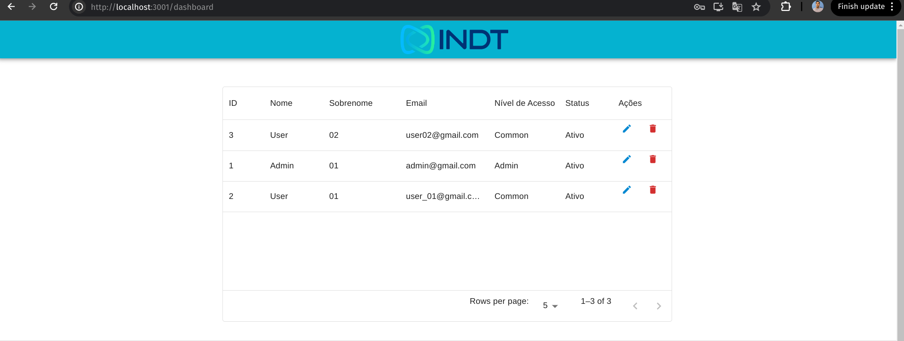
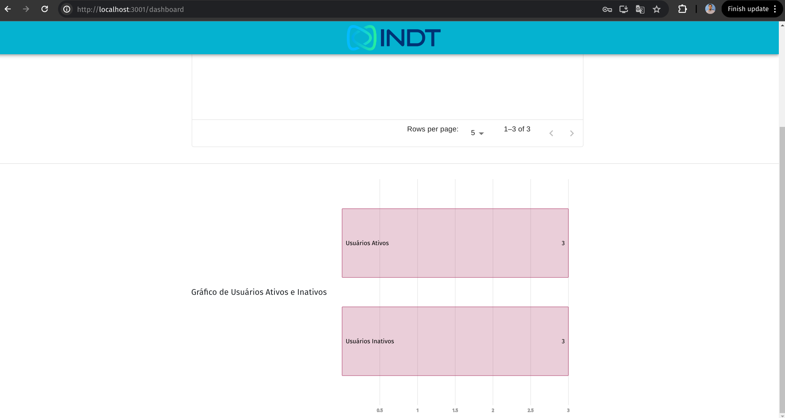
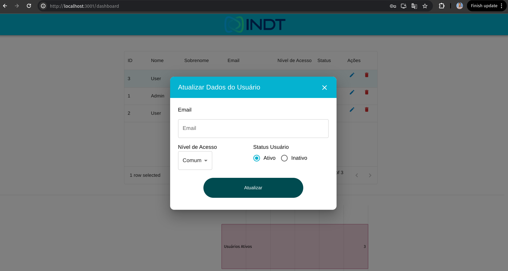
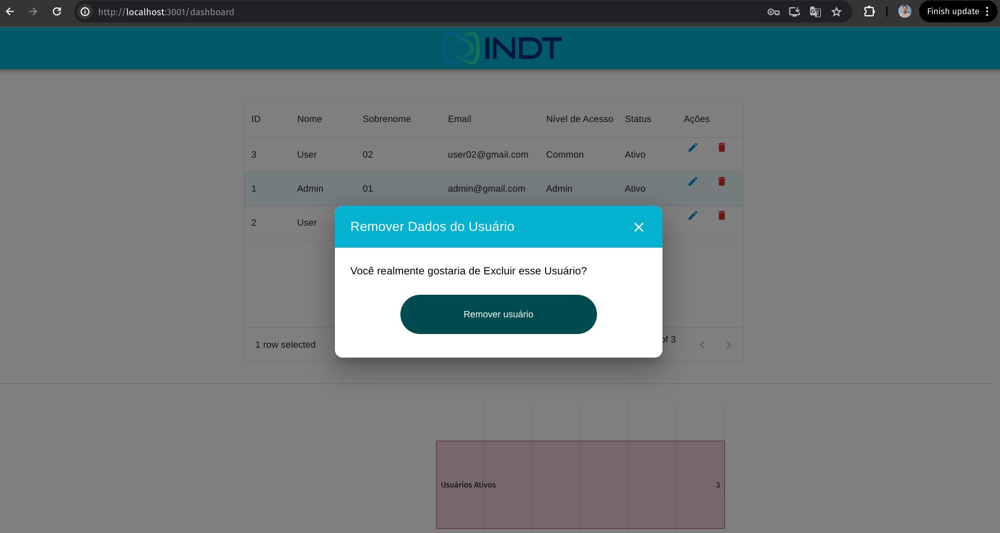

# INDT Dashboard Frontend

- Este projeto consiste num Frontend para listagem de usuários e atualização destes dados. Utiliza de React com Material UI para o desenvolvimento de componentes e telas. Também foi possível renderizar os usuários ativos e inativos num gráfico de D3Chart

# 🧰 Technologies

- Frontend
  - React
  - TypeScript
  - MaterialUI
  - ReactHookForm
  - Axios

# 🚀 Como Usar

### 💾 Clone o Repositório

```
- git clone git@github.com:WalmirLucena/bemol-frontend.git
```

## Executando o projeto

É necessário que você tenha o yarn ou npm na sua máquina. Após a intalação destes rode o seguinte comando

- Subindo com yarn

  ```
   - yarn first-install
  ```

  - Subindo com npm

  ```
   - npm install
  ```

  📋 Verifique a Aplicação Web em http://localhost:3001

# Possíveis melhorias

- Fazer Testes com o Jest
- Adicionar estrutura de pastas Domain, Data, Infra para aumentar a confiabilidade do código
- Adicionar o Context ou Redux para o controle de estado global após login

# Imagens do Projeto






